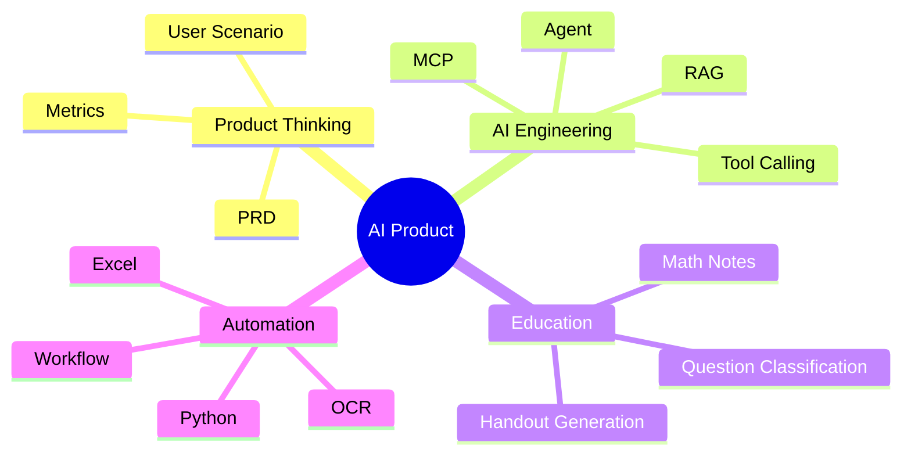

### Hi, I'm `@zyh364267040` 👋

从真实业务场景出发，学习 AI 产品与自动化工作流。  
关注：AI 产品经理学习 · Python 爬虫 · 数学教育 · 办公自动化 · Agent 工作流

  
  
  

## 🧭 About me

- 以前主要写 Python 爬虫和自动化脚本，做过网页数据采集、异步爬虫、并发编程等实践
- 现在从基层业务、数学教学和 Python 自动化实践出发，学习 AI 产品经理相关能力
- 关注 AI 如何进入真实工作流，而不只是停留在聊天和演示
- 喜欢把复杂任务拆成可执行流程：资料整理、表格处理、讲义生成、知识库构建
- 当前重点学习：Agent、RAG、MCP、Tool Calling、本地模型、AI 产品原型设计

## 🚀 What I'm building

| 方向 | 项目想法 | 目标 |
|---|---|---|
| 📚 AI + 数学教育 | AI 数学讲义生成器 | 把截图、教材、笔记整理成可直接上课的 Markdown 讲义 |
| 🕷️ Python 爬虫 | 网页数据采集与自动化 | 爬虫、异步任务、并发处理、数据清洗 |
| 🗂️ 办公自动化 | 党务办公助手 | 会议记录、Excel 填写、材料模板、文件归档自动化 |
| 🤖 Agent Workflow | 本地优先 AI 工作流 | 用本地模型和工具调用完成真实任务 |

## 🧰 Stack & Tools

  
  
  
  
  
  
  
  
  
  
  

## 📌 Featured repositories

<table>
<tr>
<td width="50%">

### 📘 MathNotes
数学学习笔记与资料整理。  
后续会作为 AI 数学讲义、错题整理、知识点结构化的基础资料库。

<a href="https://github.com/zyh364267040/MathNotes">查看仓库 →</a>

</td>
<td width="50%">

### 🕷️ SpiderProject
Python 爬虫与网页自动化学习项目。  
包含多个数据采集、网页解析和脚本化处理实践。

<a href="https://github.com/zyh364267040/SpiderProject">查看仓库 →</a>

</td>
</tr>
<tr>
<td width="50%">

### 🧮 gaokaomath
历年高考数学真题资料库。  
计划结合 OCR、知识点标签和 RAG，做成数学复习知识库。

<a href="https://github.com/zyh364267040/gaokaomath">查看仓库 →</a>

</td>
<td width="50%">

### ⚙️ concurrent_programming
Python 并发编程学习。  
包括多线程、多进程、线程池、异步 IO 等内容。

<a href="https://github.com/zyh364267040/concurrent_programming">查看仓库 →</a>

</td>
</tr>
</table>

## 📊 GitHub stats

## 🌱 Current learning map

## 📫 Contact

  
  

### Building useful AI workflows from real problems.

